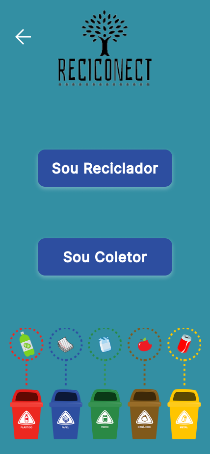
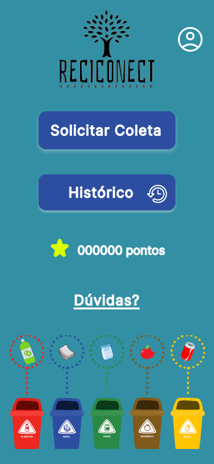
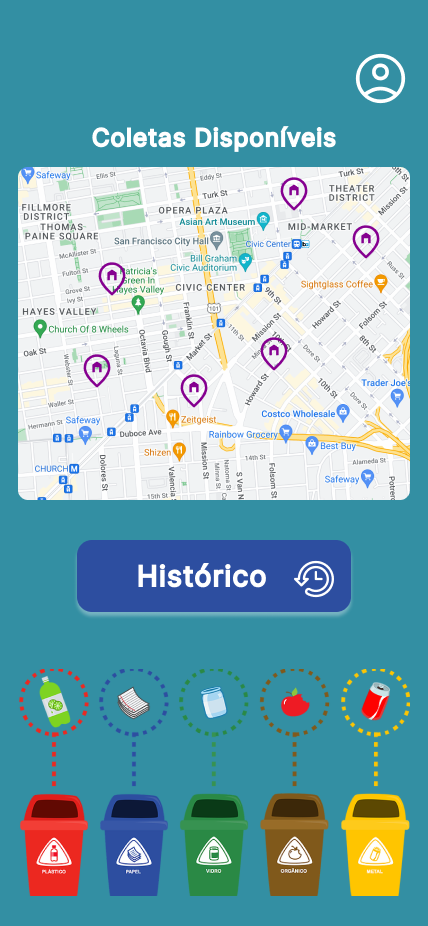

# Funcionamento do Aplicativo Mobile

<video width="300" height="600" controls>
  <source src="telas/VIDEO.mp4" type="video/mp4">
  Seu navegador não suporta o formato do vídeo.
</video>

### Aqui estão algumas imagens que representam o funcionamento do nosso aplicativo Reciconect, representando a sua versão de Alta Fidelidade:

## 1. **Tela de Início**

  

## 2. **Acesso de Usuário**

  

### **Telas de Usuário Reciclador**

  <table>
    <tr>
      <td>
      <figure>
        
        <figcaption>Figura 1 - Tela inicial Reciclador</figcaption>
      <td>
      <figure>
        
        <figcaption>Figura 2 - Tela inicial - Menu</figcaption>
      </td>
    </tr>
    <tr>
      <td>
      <figure>
        
        <figcaption>Figura 3 - Tela histórico Reciclador</figcaption>
      </td>
      <td>
      <figure>
        
        <figcaption>Figura 4 - Tela histórico - Menu</figcaption>
      </td>
    </tr>
    <tr>
      <td>
      <figure>
        
        <figcaption>Figura 5 - Tela pendentes Reciclador</figcaption>
      </td>
      <td>
      <figure>
        
        <figcaption>Figura 6 - Tela pendentes - Menu</figcaption>
      </td>
    </tr>
    <tr>
      <td>
      <figure>
        
        <figcaption>Figura 7 - Tela reservados Reciclador</figcaption>
      </td>
      <td>
      <figure>
        
        <figcaption>Figura 8 - Tela reservados - Menu</figcaption>
      </td>
    </tr>
    <tr>
      <td>
      <figure>
        
        <figcaption>Figura 9 - Tela finalizados Reciclador</figcaption>
      </td>
      <td>
      <figure>
        
        <figcaption>Figura 10 - Tela finalizados - Menu</figcaption>
      </td>
    </tr>
    <tr>
      <td>
      <figure>
        
        <figcaption>Figura 11 - Tela coleta Reciclador</figcaption>
      </td>
      <td>
      <figure>
        
        <figcaption>Figura 12 - Tela coleta - Menu</figcaption>
      </td>
    </tr>
  </table>
  

### **Telas de Usuário Coletor**

  <table>
    <tr>
      <td>
      <figure>
        
        <figcaption>Figura 13 - Tela coleta Usuário</figcaption>
      <td>
      <figure>
        
        <figcaption>Figura 14 - Tela coleta - Menu</figcaption>
      </td>
    </tr>
    <tr>
      <td>
      <figure>
        
        <figcaption>Figura 15 - Tela histórico Reciclador</figcaption>
      <td>
      <figure>
        
        <figcaption>Figura 16 - Tela histórico - Menu</figcaption>
      </td>
    </tr>
    <tr>
      <td>
      <figure>
        
        <figcaption>Figura 17 - Tela reservados Reciclador</figcaption>
      <td>
      <figure>
        
        <figcaption>Figura 18 - Tela reservados - Menu</figcaption>
      </td>
    </tr>
    <tr>
      <td>
      <figure>
        
        <figcaption>Figura 19 - Tela finalizados Reciclador</figcaption>
      <td>
      <figure>
        
        <figcaption>Figura 20 - Tela finalizados - Menu</figcaption>
      </td>
    </tr>
    <tr>
      <td>
      <figure>
        
        <figcaption>Figura 21 - Tela coleta Reciclador</figcaption>
      <td>
      <figure>
        
        <figcaption>Figura 22 - Tela coleta - Menu</figcaption>
      </td>
    </tr>
    <tr>
      <td>
      <figure>
        
        <figcaption>Figura 23 - Tela coleta Reciclador</figcaption>
      <td>
      <figure>
        
        <figcaption>Figura 24 - Tela coleta - Menu</figcaption>
      </td>
    </tr>
    <tr>
      <td>
      <figure>
        
        <figcaption>Figura 25 - Tela coleta Reciclador</figcaption>
      <td>
      <figure>
        
        <figcaption>Figura 26 - Tela coleta - Menu</figcaption>
      </td>
    </tr>
    <tr>
      <td>
      <figure>
        
        <figcaption>Figura 27 - Tela coleta Reciclador</figcaption>
      <td>
      <figure>
        
        <figcaption>Figura 28 - Tela coleta - Menu</figcaption>
      </td>
    </tr>
    <tr>
      <td>
      <figure>
        
        <figcaption>Figura 29 - Tela coleta Reciclador</figcaption>
      <td>
      <figure>
        
        <figcaption>Figura 30 - Tela coleta Usuário</figcaption>
      </td>
    </tr>
  </table>