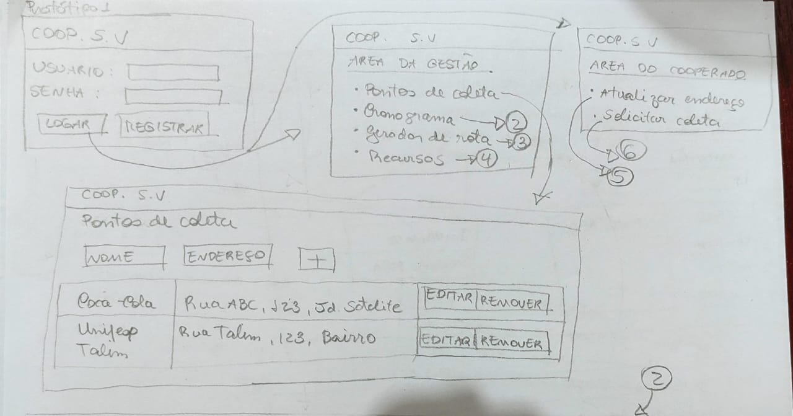
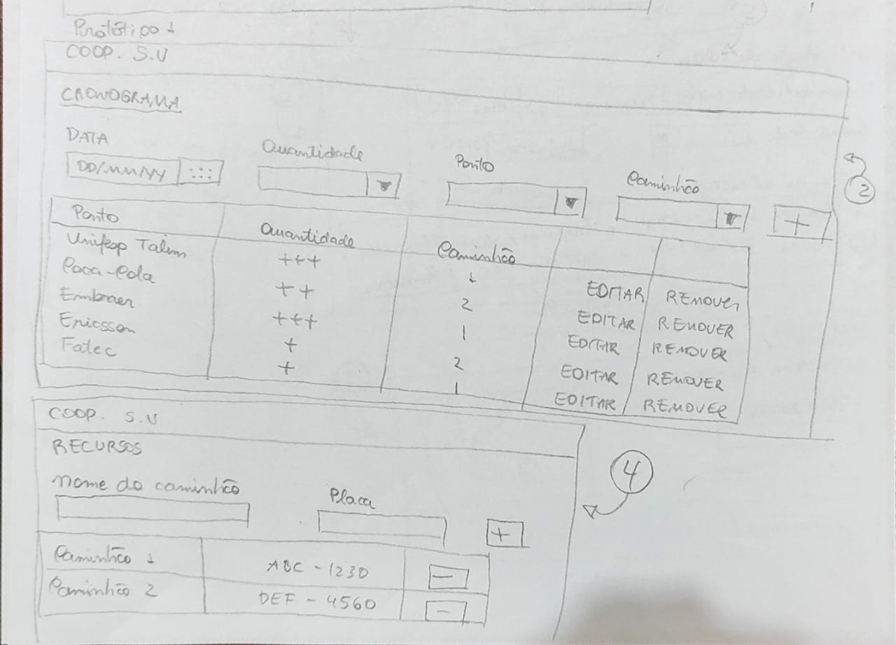
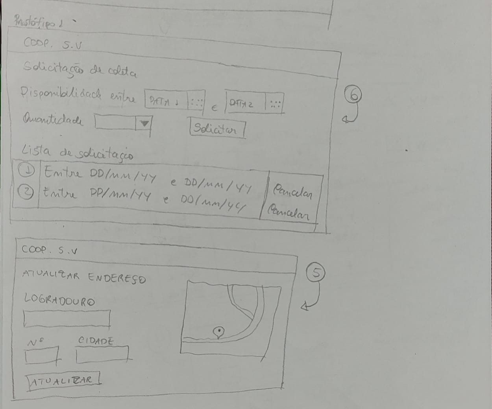
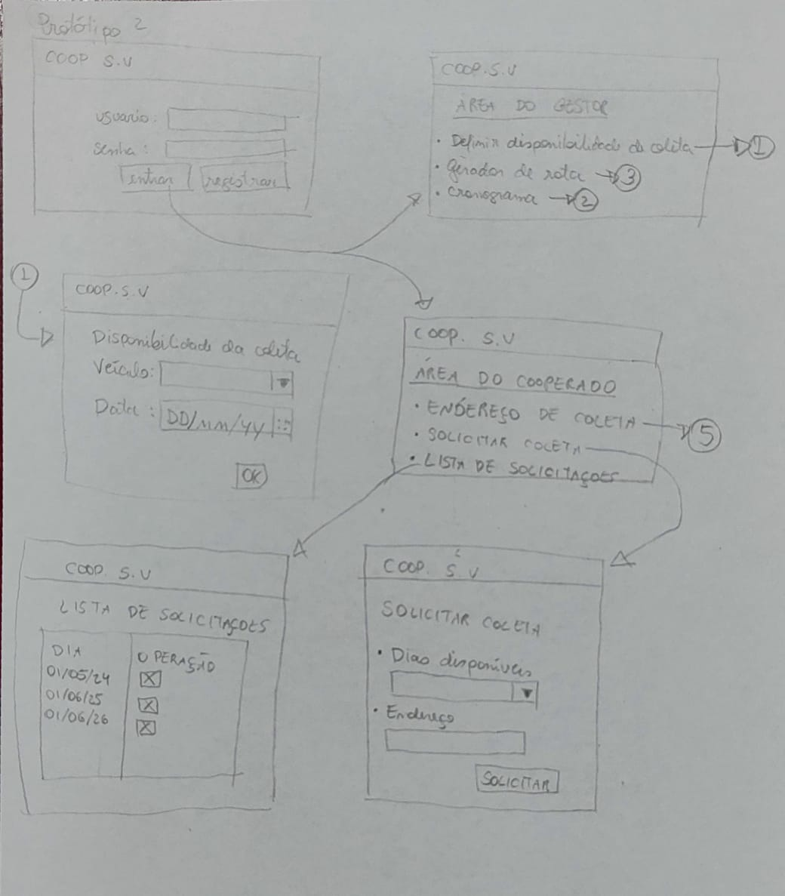
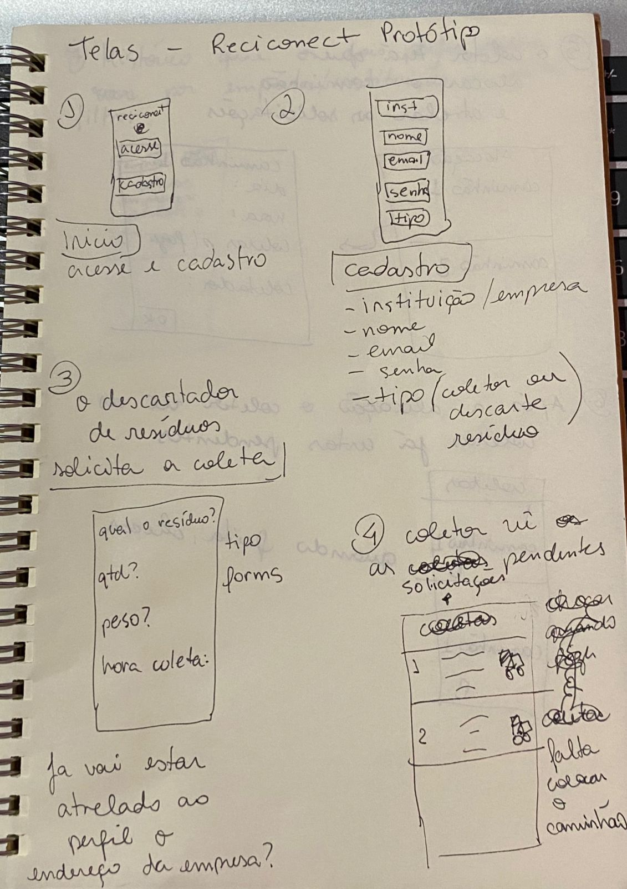
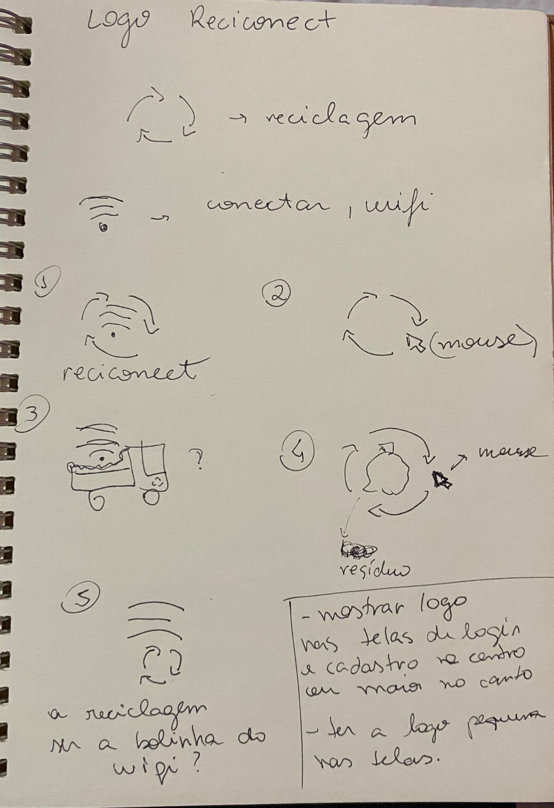
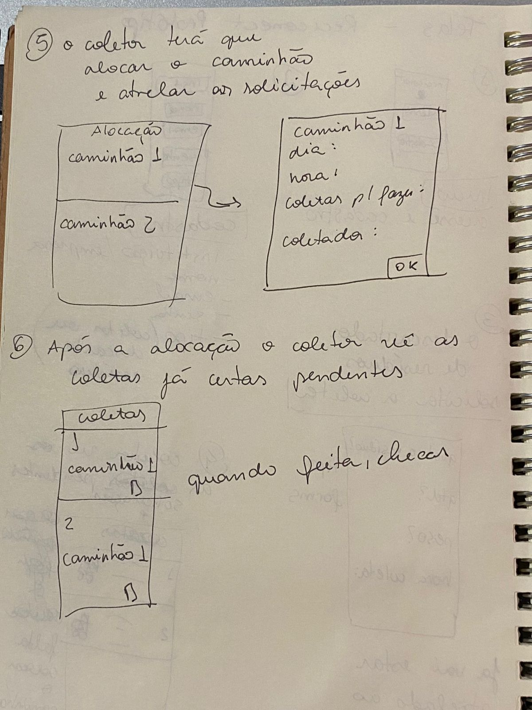
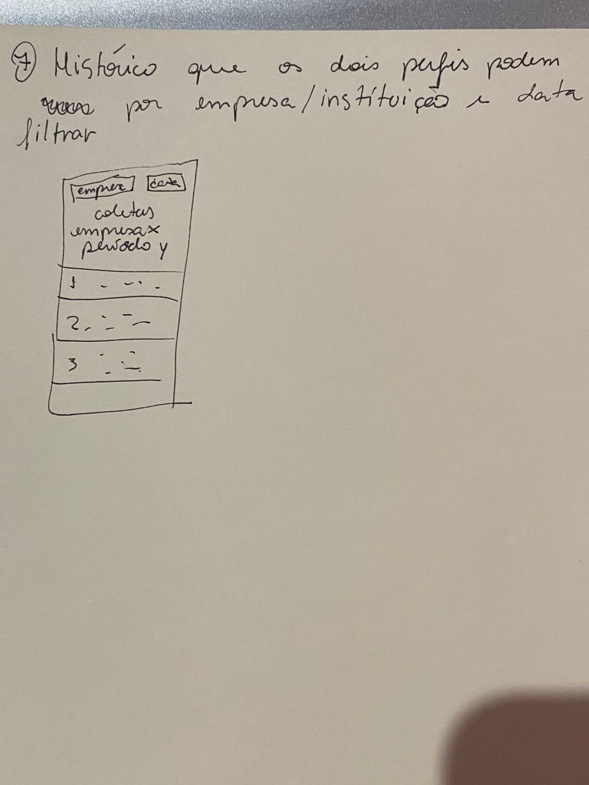
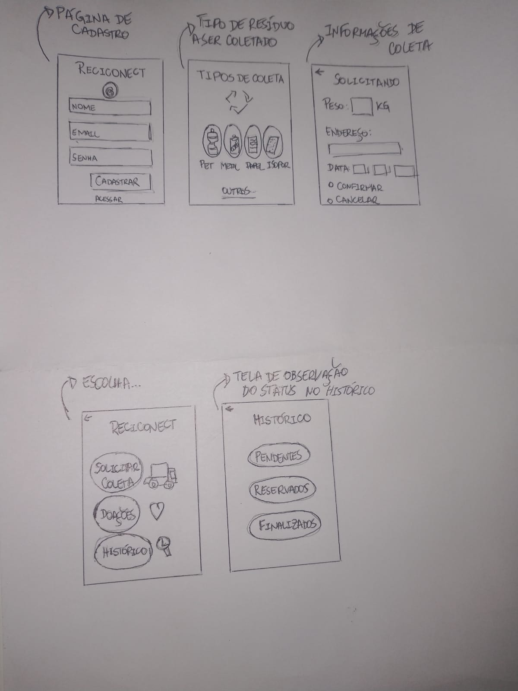

# Brainstorming

Após bastante discussão e alguns esboços desenhados entre os componentes do grupo a respeito do tema que está sendo considerado na disciplina foram realizados, assim como se segue nos arquivos que compõem esta pasta.
Fica claro que, muitas idéias foram aproveitadas, e cabe ainda bastante aprimoramento das soluções aplicadas.

