# Figma

O Low Fidelity Prototype foi feito utilizando a ferramenta Figma, assim como a simulação de utilização da interface. Com base nas ideias geradas com a discussão do problema que está sendo considerado, foi possível abstrair e construir partes importantes da iteração do usuário na plataforma.

Além dos arquivos no repositório, também é possível acessar o prototipo e testar [AQUI](https://www.figma.com/proto/jq9i8fQOfVgLJ4odraliUC/Reciconect---Low-Fidelity-Prototype?type=design&node-id=1-33&t=YEsFUKvnB1SaNULa-1&scaling=min-zoom&page-id=0%3A1&starting-point-node-id=1%3A33&mode=design)

## Telas
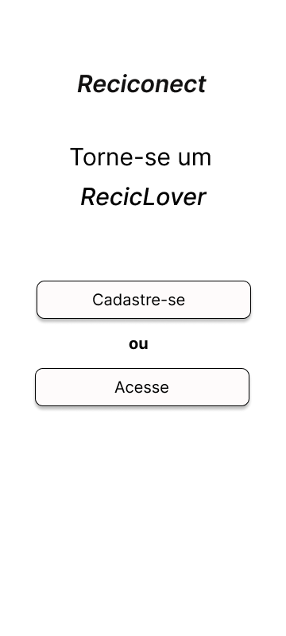
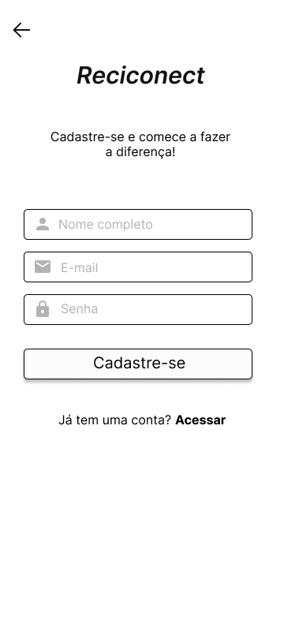
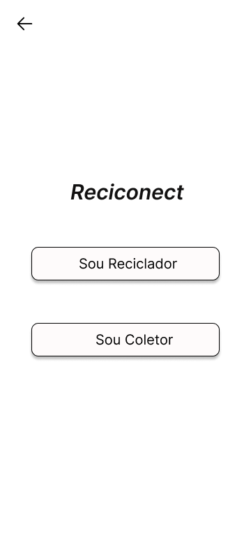
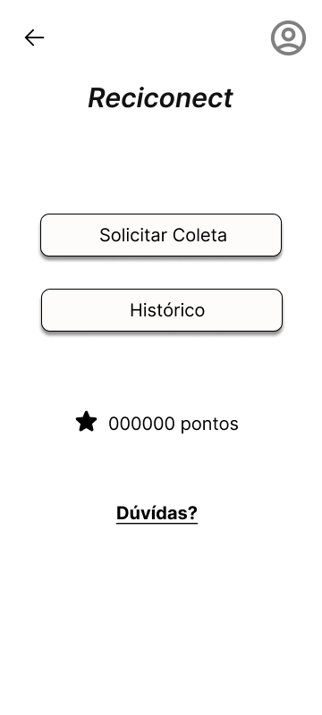
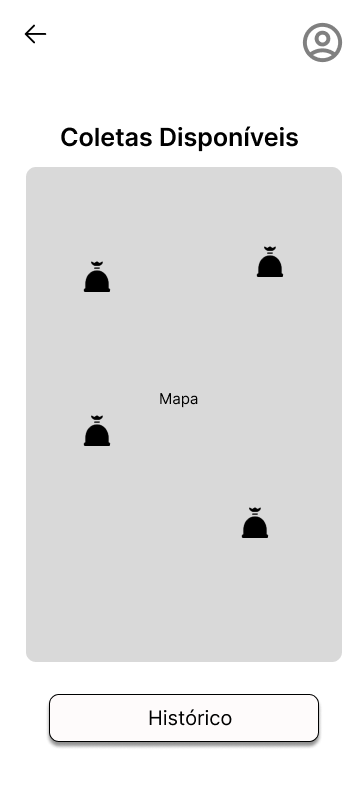
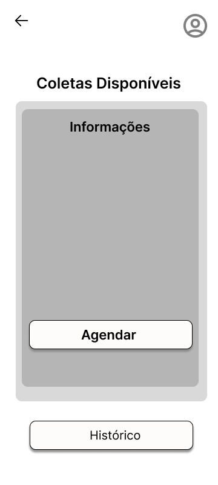
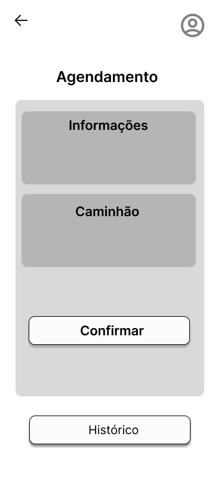
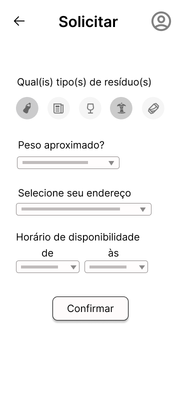
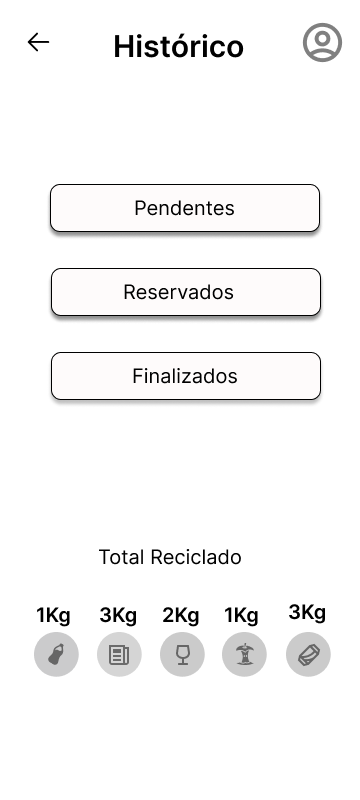
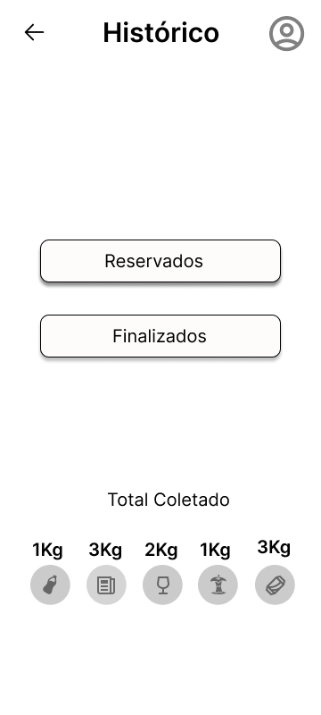
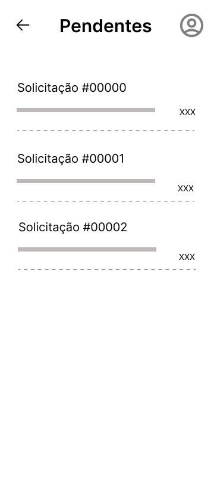
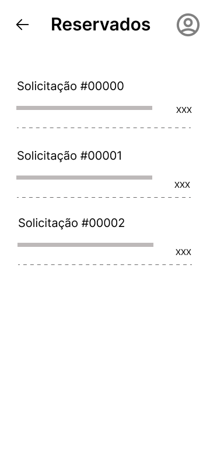
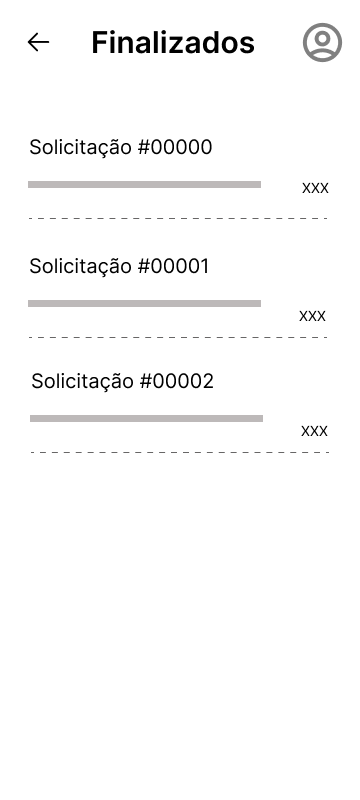